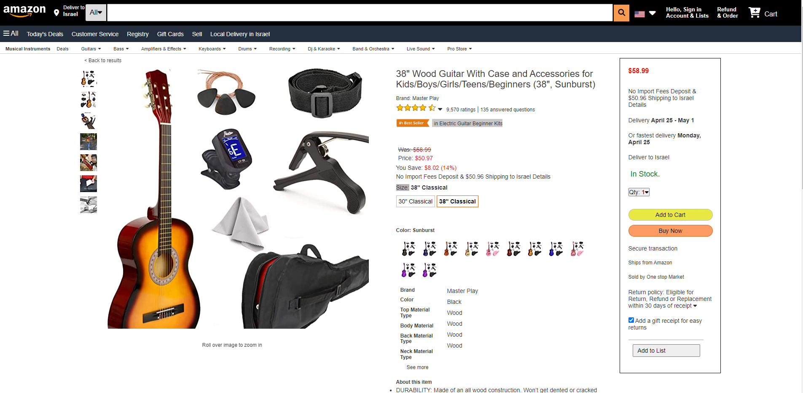
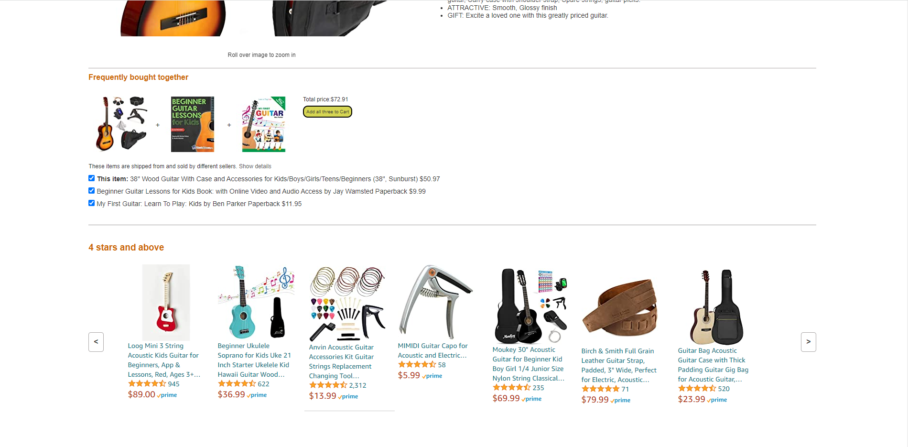

# Amazon-Mockup-Project

**Version 1.00**

Code and document for the amazon page markup.

A copy of the amazon page with Html and Css syntax.

---
## App Link
[Amazon Mockup App](https://quiet-cajeta-56146a.netlify.app/)
---

## Contributors

- Amir Gilboa <amirg76@gmail.com>

---

### License & copyright

© Amir Gilboa , Fullstack Developer
